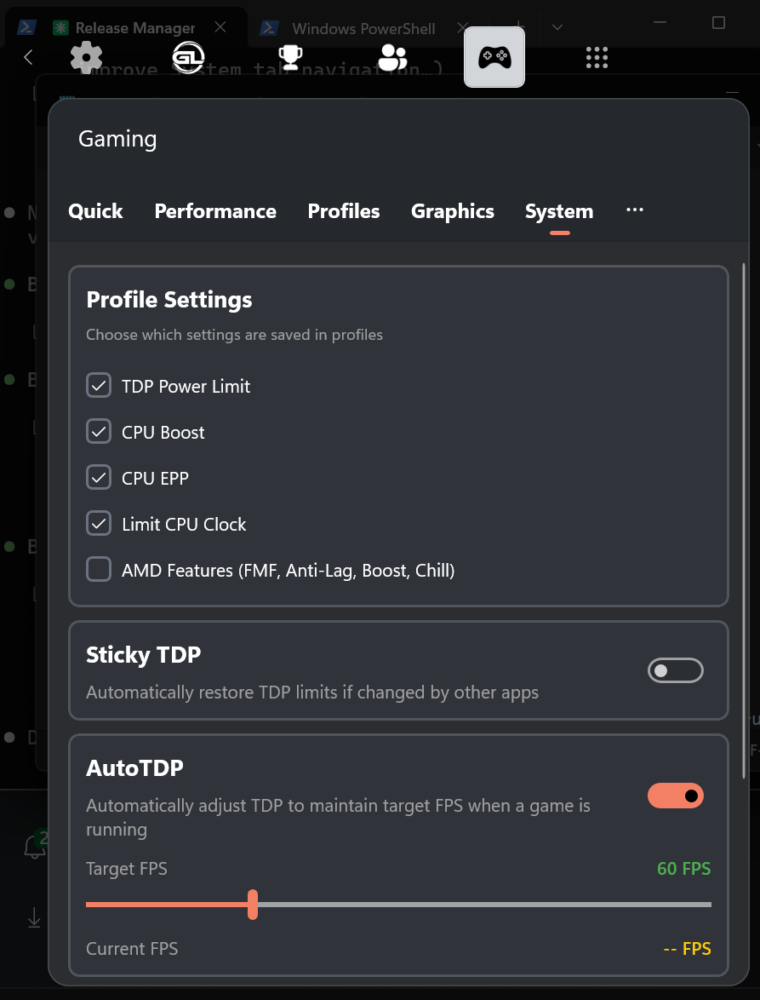

# Xbox Gaming Bar

## What is it?

Xbox Gaming Bar is a helper tool for gamers to control all gaming-related settings using the gamepad/game controller.
Xbox Gaming Bar is built as a Xbox Game Bar widget as the frontend, and a Win32 helper as the backend tool.

## Features

### Quick Settings
- Customizable tile grid for quick access to frequently used settings
- One-tap toggles for TDP Mode, Profile, Overlay, Lossless Scaling, and more
- Custom keyboard shortcut tiles with add/remove functionality
- Device-specific tiles (Legion Touchpad, Light Mode) when supported hardware detected

### Performance Control
- **TDP Power Limit** - Adjust system TDP with real-time monitoring
- **Sticky TDP** - Automatically restore TDP limits if changed by other apps
- **AutoTDP (Beta)** - Automatically adjust TDP to maintain target FPS
  - PID controller with smart sweet spot detection
  - Conservative algorithm to find minimum TDP needed
  - OSD overlay showing AutoTDP status and adjustments
- **CPU Boost** - Enable or disable CPU boost
- **CPU EPP** - Set CPU Energy Performance Preference (0-100)
- **CPU Clock Limit** - Set maximum CPU clock speed

### Per-Game Profiles
- Save and load settings per game
- Automatic profile switching when games are detected
- Configurable settings per profile (TDP, CPU Boost, EPP, CPU Clock, AMD features)

### Performance Overlay (RTSS)
- Real-time on-screen display using RivaTuner Statistics Server
- Multiple detail levels (Off, Minimal, Standard, Detailed)
- Shows FPS, frametime, CPU/GPU usage, temperatures, power, memory, battery
- Fan speed display for supported devices
- AutoTDP status in detailed mode

### Graphics Settings
- **Resolution** - Change display resolution
- **HDR** - Toggle HDR on/off (when supported)
- **Refresh Rate** - Change display refresh rate

### AMD Radeon Features
- **Radeon Super Resolution (RSR)** - GPU upscaling with sharpness control
- **AMD Fluid Motion Frames (AFMF)** - Frame generation
- **Radeon Anti-Lag** - Reduce input latency
- **Radeon Boost** - Dynamic resolution scaling
- **Radeon Chill** - Power saving when idle with min/max FPS control

### Lossless Scaling Integration
- Launch and control Lossless Scaling from the widget
- Configure scaling type, frame generation, and profiles
- Quick toggle from Quick Settings

### Legion Go Support
- Automatic device detection for Legion Go and Legion Go 2
- **Touchpad Toggle** - Enable/disable touchpad
- **RGB Lighting** - Control light mode, color, and brightness
- **Performance Modes** - Quiet, Balanced, Performance, Custom
- **Custom TDP** - Fine-grained TDP control (SPL, SPPL, FPPT)
- **Fan Full Speed** - Toggle maximum fan speed
- **Gyroscope** - Toggle gyroscope (WIP)

### System Settings
- Profile settings configuration
- Sticky TDP interval adjustment
- AutoTDP configuration with target FPS
- Manufacturer WMI TDP option for supported devices

## Controller Navigation

The widget is designed for full gamepad/controller navigation:
- D-pad navigation between all controls
- Focus indicators on all interactive elements
- Scroll views automatically bring focused items into view

## Installation

### Step 1: Install the App

#### Option A: Use Install Script (Recommended)

1. Download and extract the latest release package from [Releases](https://github.com/namquang93/XboxGamingBar/releases)
2. Right-click `Install.ps1` → **Run with PowerShell**
3. If prompted, click **Yes** to allow Administrator access

The script automatically:
- Closes any blocking processes (Game Bar, previous widget versions)
- Uninstalls previous versions cleanly
- Installs the signing certificate
- Installs all required dependencies
- Installs the widget

**Silent install:** Run `.\Install.ps1 -Force` from an Admin PowerShell.

#### Option B: Install Certificate (Manual Install)

1. Right-click the `.cer` certificate file → **Install Certificate**
2. Select **Local Machine** → **Place in: Trusted People**
3. Install dependencies from `Dependencies\x64` folder (double-click each `.appx` file)
4. Double-click the `.msixbundle` to install

### Updating

To update to a new version, simply double-click the `.msixbundle` file and click **Update**.

### Step 2: Enable the Widget in Game Bar

1. Open Xbox Game Bar (Win + G)
2. Click the **Widgets** menu (widget icon)
3. Scroll down to find **"Gaming"**
4. Click on it to enable the widget

### Step 3: Enable Game Detection (Required for Per-Game Profiles)

1. Open Xbox Game Bar (Win + G)
2. Go to **Settings** (gear icon)
3. Scroll down and click **More Settings**
4. Find **Gaming** widget
5. Enable **"Know which game or app is in focus"**

This allows the widget to detect which game is running for automatic profile switching and AutoTDP.

For detailed instructions, see our [Wiki](https://github.com/namquang93/XboxGamingBar/wiki/Installation-Instruction).

## Requirements

- Windows 10/11
- Xbox Game Bar
- RivaTuner Statistics Server (for OSD overlay)
- AMD GPU (for Radeon features)
- Supported handheld device (for device-specific features)

## Technology

Xbox Gaming Bar is 100% free and open source. Built with C#.

### Libraries Used
- **LibreHardwareMonitor** - Performance statistics and sensor data
- **RyzenAdj** - AMD TDP control
- **RTSSSharedMemoryNET** - RTSS OSD integration
- **ADLX** - AMD Display Library for Radeon features

## Credits

Original project created by [namquang93](https://github.com/namquang93).

## License

This project is open source. See LICENSE file for details.
