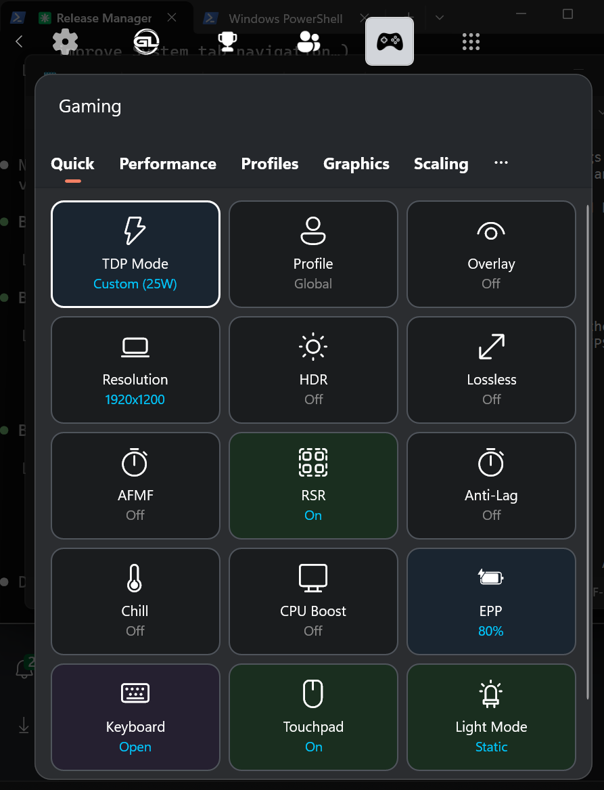
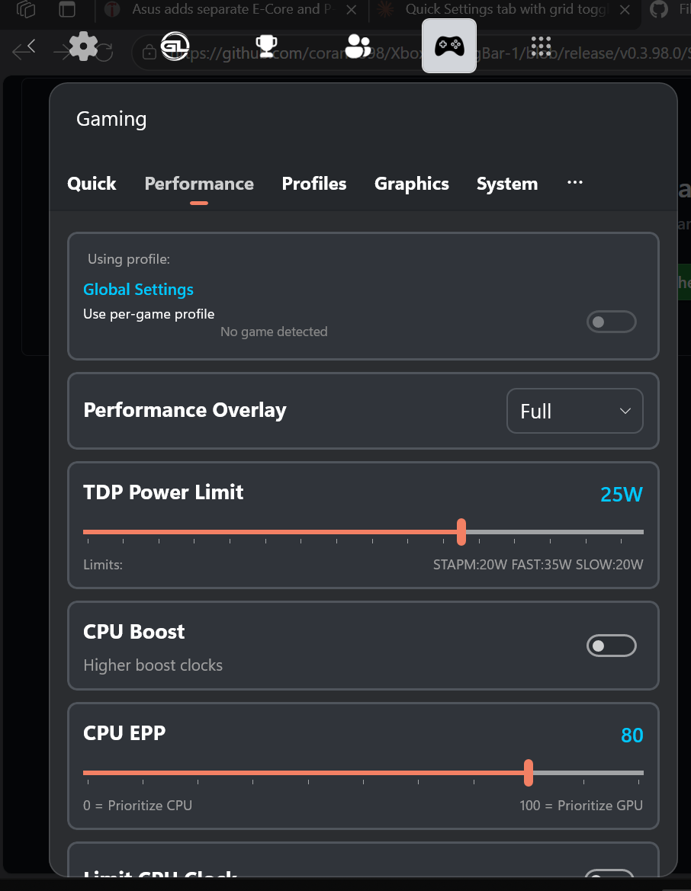
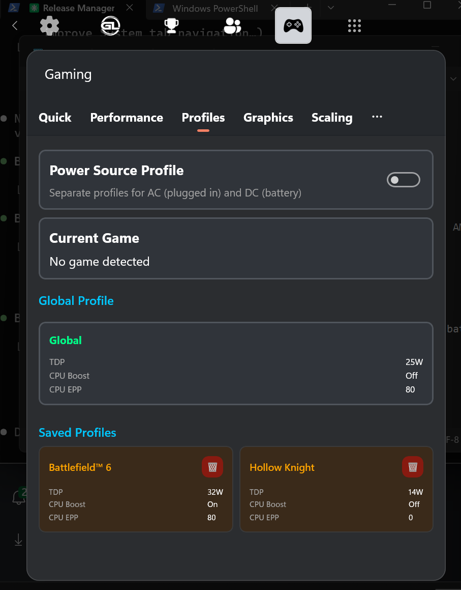
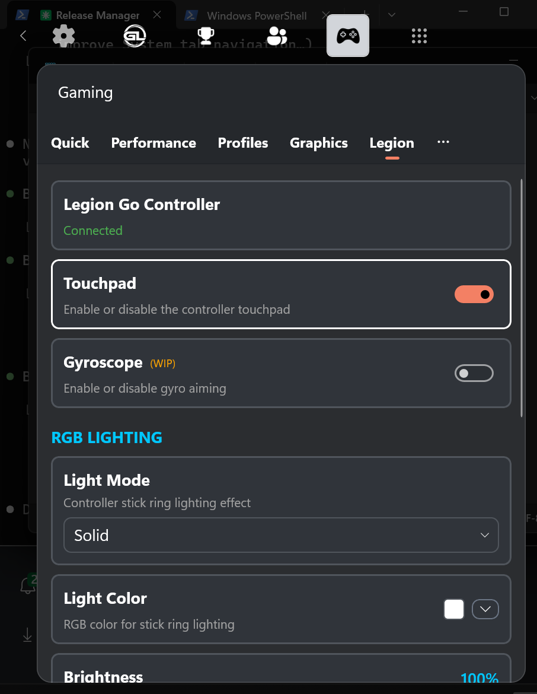
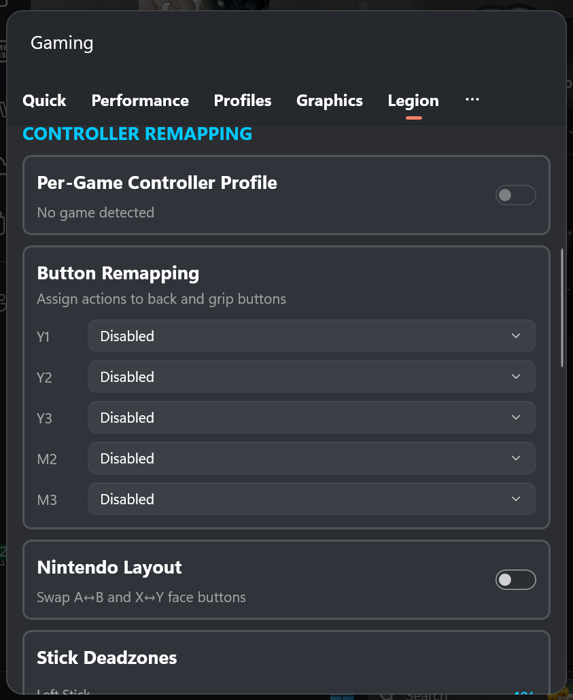
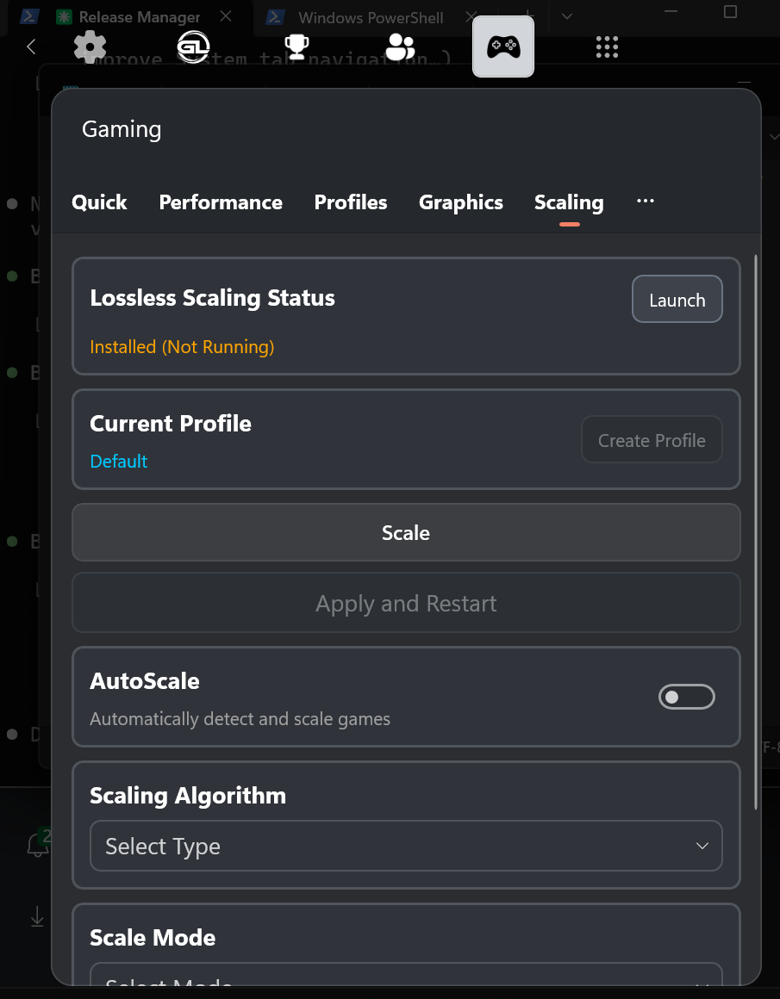
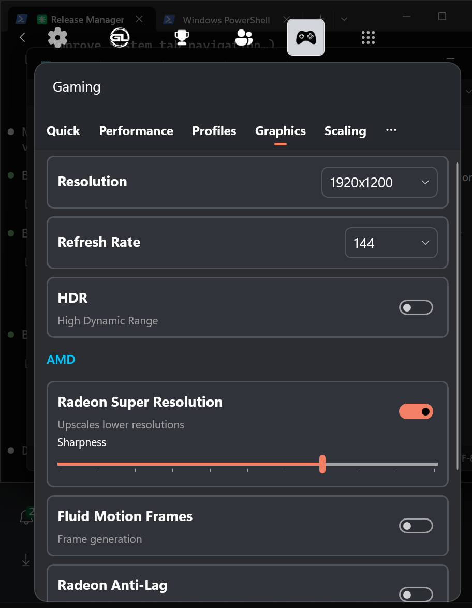
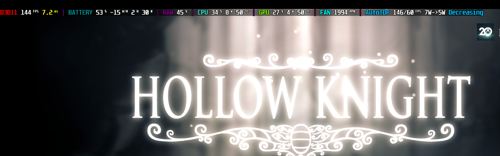

# GoTweaks

A powerful Xbox Game Bar widget for controlling gaming settings with your controller. Designed for handheld gaming PCs with deep integration for Legion Go, AMD Radeon GPUs, and performance tuning.

[](https://www.youtube.com/watch?v=6zoOBG9X_WU)

*Video by [GameTechPlanet](https://www.youtube.com/@GameTechPlanet) - Note: Installation has been simplified and the widget has received many updates since this video.*

## Features

### Quick Settings
Customizable dashboard with quick-access tiles for your most-used settings.

- One-tap toggles for TDP Mode, Profile, Overlay, Lossless Scaling
- Custom keyboard shortcut tiles with add/remove functionality
- Device-specific tiles that appear when supported hardware is detected



---

### Performance Control
Fine-tune power and CPU settings for optimal performance or battery life.

**TDP Management:**
- **Custom TDP** - Adjust system power limits with real-time monitoring
- **Sticky TDP** - Automatically restore TDP if changed by other apps
- **TDP Boost** - Per-game boost with separate SPPT/FPPT controls

**AutoTDP (Beta):**
- Automatically adjusts TDP to maintain your target FPS
- Smart algorithm finds the minimum power needed
- Real-time status shown in OSD overlay

**CPU Controls:**
- **CPU Boost** - Enable or disable CPU boost
- **CPU EPP** - Energy Performance Preference (0-100)
- **Min/Max CPU State** - Control CPU clock speed range



---

### Per-Game Profiles
Automatically apply your preferred settings when each game launches.

- Automatic profile switching on game detection
- Saves all performance settings per game:
  - TDP, TDP Boost, CPU settings
  - AMD Radeon features
  - Lossless Scaling configuration
  - Legion Go controller settings (if applicable)



---

### Legion Go Support
Comprehensive support for Legion Go and Legion Go S with automatic device detection.

**Performance Modes:**
- Quiet, Balanced, Performance, and Custom modes
- Custom TDP with fine-grained control (SPL, SPPL, FPPT)
- Fan Full Speed toggle

**Controller Settings:**
- **Button Remapping** - Customize M2, M3, Y1, Y2, Y3 buttons
- **Nintendo Layout** - Swap button layout
- **Stick Deadzones** - Adjust left/right stick deadzones (0-50%)
- **Gyroscope Settings:**
  - Enable/disable with target selection
  - Sensitivity X/Y adjustment
  - Invert axes options
  - Activation mode (Hold/Toggle) with button selection
- **Vibration Mode** - Configure vibration behavior
- **Touchpad Haptics** - Toggle haptic feedback

**RGB Lighting:**
- Light mode, color, brightness, and speed control
- Power light toggle

**Other:**
- Touchpad toggle
- Battery charge limit





---

### AMD Radeon Features
GPU-based enhancements for AMD graphics cards.

**Upscaling & Frame Generation:**
- **Radeon Super Resolution (RSR)** - GPU upscaling with sharpness control
- **AMD Fluid Motion Frames (AFMF)** - Frame generation

**Performance:**
- **Radeon Anti-Lag** - Reduce input latency
- **Radeon Boost** - Dynamic resolution scaling

**Power Saving:**
- **Radeon Chill** - Reduce power when idle with min/max FPS control

**Image Quality:**
- **Image Sharpening** - Enhance visual clarity
- **Display Color Controls** - Brightness, contrast, saturation, color temperature


---

### Lossless Scaling Integration
Control Lossless Scaling directly from the widget.

- Launch and manage Lossless Scaling
- Configure scaling type and factor
- Frame generation modes (LSFG2, LSFG3)
- Auto-scaling with delay configuration
- Anime4K and FSR optimization options
- Per-profile configurations



---

### Graphics Settings
Display and resolution management.

- Resolution control with auto-detection
- Refresh rate adjustment
- HDR toggle (when supported)



---

### Performance Overlay (OSD)
Real-time on-screen display powered by RivaTuner Statistics Server.

**Multiple Detail Levels:**
- Off, Minimal, Standard, Detailed

**Metrics Displayed:**
- FPS and frametime graph
- CPU/GPU usage and temperatures
- Power consumption
- Memory and VRAM usage
- Battery level and status
- Fan speed (supported devices)
- TDP Limits (SPL/SPPT/FPPT) or current performance mode
- AutoTDP status (in detailed mode)



---

### Controller Navigation
Designed for full gamepad control - no mouse needed.

- D-pad navigation between all controls
- Visual focus indicators
- Automatic scroll to focused items
- Works with Xbox, PlayStation, and other controllers

---

## Installation

### Option A: Install Script (Recommended)

1. Download the latest release from [Releases](https://github.com/namquang93/XboxGamingBar/releases)
2. Extract the package
3. Right-click `Install.ps1` → **Run with PowerShell**
4. Click **Yes** if prompted for Administrator access

The script automatically handles:
- Closing blocking processes
- Uninstalling previous versions
- Installing certificates and dependencies
- Installing the widget

**Silent install:** `powershell.exe -ExecutionPolicy Bypass -File .\Install.ps1 -Force`

**Troubleshooting:** If the script doesn't run, open PowerShell as Administrator and run:
```powershell
Set-ExecutionPolicy -ExecutionPolicy Bypass -Scope Process
.\Install.ps1
```

### Option B: Manual Install

1. Install the `.cer` certificate → Local Machine → Trusted People
2. Install dependencies from `Dependencies\x64` folder
3. Double-click the `.msixbundle` to install

### Enable the Widget

1. Open Xbox Game Bar (`Win + G`)
2. Click the **Widgets** menu
3. Find and enable **"Gaming"**

### Enable Game Detection

Required for per-game profiles and AutoTDP:

1. Open Xbox Game Bar → **Settings** → **More Settings**
2. Find **Gaming** widget
3. Enable **"Know which game or app is in focus"**


### Removing Legion Space OEM Widget
Legion Space widget if undesired can be removed using the following command from a Powershell admin shell, 

```reg delete "HKLM\SOFTWARE\Microsoft\Windows\CurrentVersion\GamingConfiguration" /v OEMGameBarwidget /f```
Now you can remove the widget by goings to Settings->Apps->Uninstall LegionGoWidget
To ReAdd: 
```reg add "HKLM\SOFTWARE\Microsoft\Windows\CurrentVersion\GamingConfiguration" /v OEMGameBarwidget /t REG_SZ /d "LegionGoGameBarWidget_ra2g5j82mn5h8" /f```


---

## Requirements

- Windows 10/11
- Xbox Game Bar
- **Optional:**
  - [RivaTuner Statistics Server](https://www.guru3d.com/download/rtss-rivatuner-statistics-server-download/) (required for OSD overlay)
  - [PawnIO](https://github.com/SuporteTI/PawnIO) (required for extended sensors like fan speed, GPU power draw on some devices)
  - AMD GPU (for Radeon features)
  - Legion Go/Go S (for device-specific features)
  - Lossless Scaling (for scaling integration)

### Smart App Control

**Important:** Windows Smart App Control may interfere with this application. If you experience issues with the app not working correctly, you may need to disable Smart App Control in Windows Security settings.

Note: Other gaming software like ASUS Armoury Crate (for ROG Ally) also faces similar compatibility issues with Smart App Control.

---

## Technology

100% free and open source. Built with C#.

### Libraries
- **LibreHardwareMonitor** - Hardware sensors and monitoring
- **RyzenAdj** - AMD TDP control
- **RTSSSharedMemoryNET** - Custom implementation with frametime graph support, optimized for low CPU and memory usage
- **ADLX** - AMD Display Library for Radeon features

---

## Credits

Original project by [namquang93](https://github.com/namquang93).

**Special Thanks:**
- **Mute** (Legion Go Discord) - For always being available for testing and providing valuable user feedback
- **[GameTechPlanet](https://www.youtube.com/@GameTechPlanet)** - For the opportunity to showcase the app and covering the widget's use cases
- **The Community** - For reporting issues and helping make this app better for everyone

## License

This project is open source. See LICENSE file for details.


