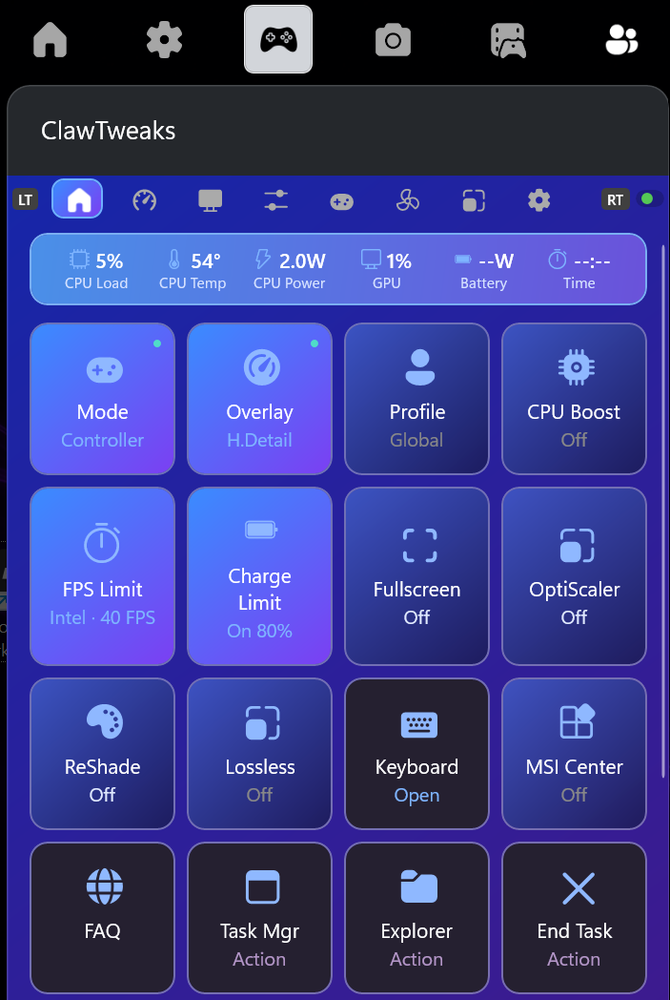
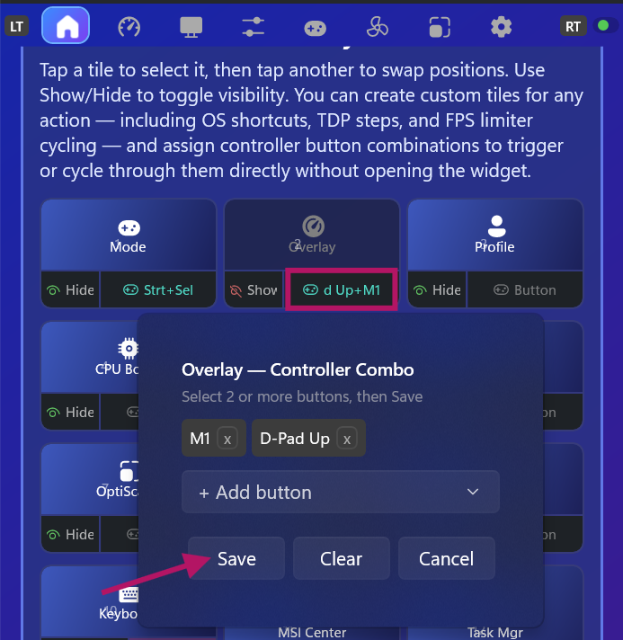

# ClawTweaks - CTW

  
  
  
  

   

A Game Bar widget for MSI Claw handheld gaming PCs. Built on the foundation of [GoTweaks](https://github.com/corando98/GoTweaks) (a Lenovo Legion Go widget), ClawTweaks replaces AMD-specific features with Intel equivalents, adds MSI Claw-specific hardware support, and introduces a wide range of new features alongside a streamlined UI.

> ### Supported Devices
> | Device | Status |
> |--------|--------|
> | **MSI Claw 8 AI+ A2VM** (Lunar Lake, MS-1T52) | ✅ Supported |
> | **MSI Claw 7 AI+ A2VM / A2VMX** (Lunar Lake, MS-1T42) | ✅ Supported |
> | MSI Claw A1M (Meteor Lake) | Not supported — different processor, EC and HW controller |
> | MSI Claw 8 EX (Panther Lake) | Possible future support — shares Intel architecture |
> | Other MSI Claw models | Not tested / not supported |
>
> **The installer will abort with an error message if run on an unsupported device.**
> **Before installing GTW - MSI Center M must be installed and running on your device**
>

> **📍 Center M needed as a base** — ClawTweaks is designed to completely disable/hide Center M (with one click). But Center is needed - Mostly for OEM Button and controller virtualization support. If you are coming from 3rd party Center M Replacements make sure to unistall everything and re-install center M properly.
> 

> ### Core Features
> | Feature | Description |
> |--------------------------|-------------------|
> | OSD | Beautiful Overlay Presets without breaking VRR. Nice additions like showing actual FPS Cap or TDP Setting |
> | TDP | Only 1 Main TDP slider. Second TDP slider is only for power users who need TDP Boost and know what it actualy is. GTW automatically add +1 TDP to PL2 wo make sure TDP is corrrectly applied with one Slider |
> | Global profiles | Full performance and display setting and button remapping support for your main settings as afondation to most games |
> | Per-game profiles | When you need special settings for particular games. just run the game and enable Performance & Display Profil or Controller Profile to set individual settings |
> | Left fron MSI Button | Since center M is gone what can we do with that button?! We added single an double click regognition to this button. You can addd pretty much any action from GTW. Like Open Steam, Playnite,Xbox or Switch from Muse to Desktop Mode, Trigger Keyboard Shortcuts, Launch you own EXE or Powershell files, Launch Browser, particula Website etc. |

---
> **⚠️ Early Software** — ClawTweaks is actively developed. Use at your own risk.

## Features

### Quick Settings
Customizable dashboard with quick-access tiles for  most-used settings.

- Gamebar widget settings for TDP, FPS Limit, Overlay, Profile, Charge Limiter and more
- **Controller ↔ Mouse mode** — switch input mode quickly via tile ore controller shortcut
- Custom keyboard shortcut tiles, predefined and user created action tiles (Brightness, Volume, Desktop,Launch Apps and own EXE (even Powershell), Gyro, Media: Play, Next Track etc.)

   
  <em>Overview — Tiles</em>

**Controller shortcut support for every tile an in App-Actions:**
 You can adjust TDP, brightness, FPS cap, overlay level, or trigger any custom action mid-game using only the controller — no interruption to gameplay.
 Examples:
- `M1 + D-Pad Up/Down` — raise or lower TDP by 1W on the fly
- `M1 + D-Pad Left/Right` — cycle FPS limit up or down
- `Select + A/B` — toggle brightness up/down
- Any combination of 2+ buttons can be assigned to any tile

   
  <em>Overview — Shortcuts: assign a controller button combo to any tile</em>

---

### Performance Control

**TDP Management:**
- Adjust power limits with real-time monitoring
- TDP Boost (PL2 / Overboost) with separate slider

**FPS Limiter:**
- **Intel IGCL** — driver-level limiter built into the Intel GPU. Unlike RTSS it does not render and then discard a frame — the limit is applied before rendering, so it costs no extra GPU work and does not consume an FPS from your headroom. Tiers: Performance (60), Balanced (40), Efficiency (30).
- **RTSS** — RivaTuner Statistics Server for finer-grained limits (30 / 40 / 60 / 90 / 120 FPS). Requires RTSS to be installed. Adds ~1 FPS of overhead compared to Intel IGCL.
- Quick toggle between Intel and RTSS mode from the Quick Settings tile or the Performance tab

**CPU Controls:**
- CPU Boost enable/disable
- OS Power Mode (Efficiency / Balanced / Performance)

   
  <em>Global performance Profiles — FPS Limit, TDP Power Limit and Overboost (PL2)</em>

**Display & Color:**
- Per-profile **Saturation / Hue / Contrast** applied live to the running game
- Saved as part of the performance & display profile (global or per game)

   
  <em>Per Game Color and Display Settings</em>

---

### Controller (MSI Claw)

ClawTweaks implements software controller emulation: it hides the physical controller via HidHide. All  customfeatures run through this virtual device.

**Button remapping — per game:**
Every hardware button on the Claw is remappable independently for each game. Profiles switch automatically when a game launches.
- **M1, M2** (right side back buttons) — remap to any gamepad button, D-pad direction, stick click, or keyboard/mouse input
- **Left front OEM button** — assign a **single-click** action and an optional **double-click** action (with adjustable detection window), e.g. toggle Controller/Mouse mode on single press and cycle through apps on double press. By default single click switches between Controller and Mouse mode
- All remaps are per-game: M1 can be "Jump" in one game and "Dodge" in another, applied automatically

   
  <em>Front MSI Button — Single and Double Click Actions</em>

  
   
  <em>Global Controller Profiles (left) vs Per Game Controller Profiles (right) — incl. keyboard/mouse remaps</em>

**Gyroscope — per game:**
- Gyro-to-right-stick — works with any game that supports stick-based aim (gyro aim in Steam, or natively)
- Gyro-to-mouse — direct cursor movement, useful for desktop or mouse-driven games
- Sensitivity X/Y, deadzone, and invert per axis
- Activation: Always On, Hold a button, or Toggle — configurable button (LT, RT, LB, RB, face buttons)
- Gyro settings saved per-game profile

**Controller ↔ Mouse mode:**
- **Controller mode** (default) — full virtual gamepad, all inputs forwarded
- **Mouse mode** — left stick → scroll, right stick → cursor, , LT/RT → mouse buttons

**Technical:**
- Virtual Xbox 360 controller via ViGEm (DInput path). (VIIPER Support coming soon).
- HidHide hides only the hw gamepad interface —  Win+G/Gamebar and long click App overview stay fully functional
- MSI Center M detection — emulation suspends automatically when MSI Center M is active

> Requires [ViGEmBus](https://github.com/nefarius/ViGEmBus) and [HidHide](https://github.com/nefarius/HidHide).

---

### Per-Game Profiles
Automatically apply your preferred settings the moment a game launches — no manual switching needed.

- Automatic profile switching on game detection via Xbox Game Bar's focus API
- Each profile saves independently: TDP, TDP Boost, FPS Limit, CPU Boost, EPP, OS Power Mode, controller mappings, gyro settings, and more
- **Default game profile** — applies a single preset to any unknown game (useful for "always cap FPS + set TDP to X for every game I haven't configured yet")
- Profile card shown in the widget header while a game is active, with the active profile name
- Per-game controller button remapping — M1/M2 behave differently in each game without touching global settings
- **Per power source (AC/DC)** — optionally store separate values for plugged-in (AC) vs battery (DC) within a profile

  
   
  <em>Global vs Per Game Profile comparison (left) &nbsp;·&nbsp; Per Game AC / DC Profiles (right)</em>

---

### Performance Overlay (OSD)
Real-time on-screen display powered by RivaTuner Statistics Server.

- FPS and frametime graph
- CPU / GPU usage and temperatures
- Power consumption, memory, VRAM
- Battery level and charge status
- Fan speed (supported devices)
- TDP limits

---

### Lossless Scaling Integration
- Launch and manage Lossless Scaling from the widget
- Configure scaling type, factor, and frame generation mode (LSFG2 / LSFG3)
- Per-profile configurations

---

### Fan Control (MSI Claw)
Custom fan curve written directly to the EC (Lunar Lake).

- Drag-to-edit fan curve with presets (Quiet / Default / Aggressive / Custom)
- **Check applied values** — reads the live EC bytes back and verifies they match the graph
- Live CPU package temperature indicator on the curve
- Turn off to hand control back to MSI's firmware *(per-game fan profiles — coming soon; the curve is currently global)*

   
  <em>Fan Settings with EC Value Check · Per Game coming soon</em>

---

### Battery Charge Limit (MSI Claw)
Cap the battery charge level to extend long-term battery lifespan.

- Granular limit slider, written to  EC via ACPI/WMI (firmware-level)
- Enforced by the EC even while the device is asleep or shut down (as long as it stays plugged in)
- Re-applied automatically on helper start / reboot, so it survives an EC reset

   
  <em>Charge Limiter</em>

---

## Installation

Download the latest release, extract the ZIP, and run `Install.bat`. The script handles everything automatically. (See the release page for step-by-step instructions).

### Enable the Widget

1. Open Xbox Game Bar (`Win + G`)
2. Click the **Widgets** menu
3. Find and enable **"Gaming"**
4. Confirm UAC so that CTW can launch as admin afte reboot
---

## Requirements

- Windows 11
- Xbox Game Bar
- **For controller emulation:** [ViGEmBus](https://github.com/nefarius/ViGEmBus) + [HidHide](https://github.com/nefarius/HidHide)
- **Optional:**
  - [RivaTuner Statistics Server](https://www.guru3d.com/download/rtss-rivatuner-statistics-server-download/) — required for OSD overlay and RTSS FPS limiter
  - [PawnIO](https://github.com/SuporteTI/PawnIO) — required for extended sensors (fan speed, GPU power draw on some devices)
  - Lossless Scaling — for scaling integration
---

## Known Limitations

- **Only supports MSI Claw 7/8 AI+ A2VM (Lunar Lake)**. The A1M (Meteor Lake) and other variants are not supported — installation will be blocked on unsupported hardware.
- This is beta software — expect rough edges and report issues.

---

## Technology

100% free and open source. Built with C#.

**Libraries used:**
- **LibreHardwareMonitor** — hardware sensors
- **RTSSSharedMemoryNET** — OSD overlay with frametime graph support
- **ViGEmBus / HidHide** — virtual controller and HID suppression

---

## Credits

Based on [GoTweaks](https://github.com/corando98/GoTweaks) by [namquang93](https://github.com/namquang93) / [corando98](https://github.com/corando98).

Some Controller emulation and gyro implementation parts adapted from [Handheld Companion](https://github.com/Valkirie/HandheldCompanion).

## License

ClawTweaks is licensed under the **GNU Affero General Public License v3 (AGPLv3)** —
see [`LICENSE`](LICENSE). In short: you are free to use, study, modify and share it,
but any distributed or network-hosted derivative must also publish its complete
source under AGPLv3. It cannot be turned into a closed-source product.

Original portions derived from [GoTweaks](https://github.com/corando98/GoTweaks) /
the Microsoft Game Bar widget sample remain under the MIT License
([`LICENSE.MIT`](LICENSE.MIT)). See [`LICENSING.md`](LICENSING.md) for the full
explanation, the trademark note, and contribution terms.

> **No prebuilt binaries.** This repo does not ship ready-to-run signed packages
> or the full packaging pipeline — building and signing is left to the user.
